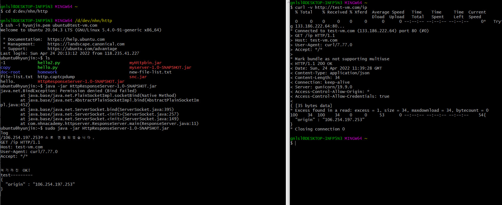
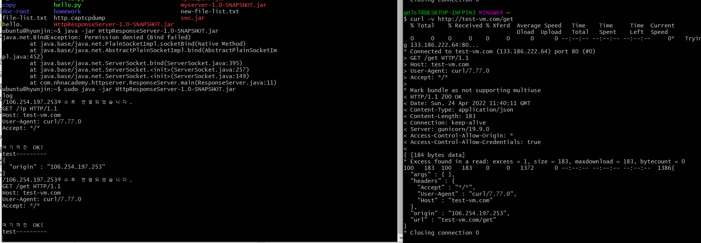
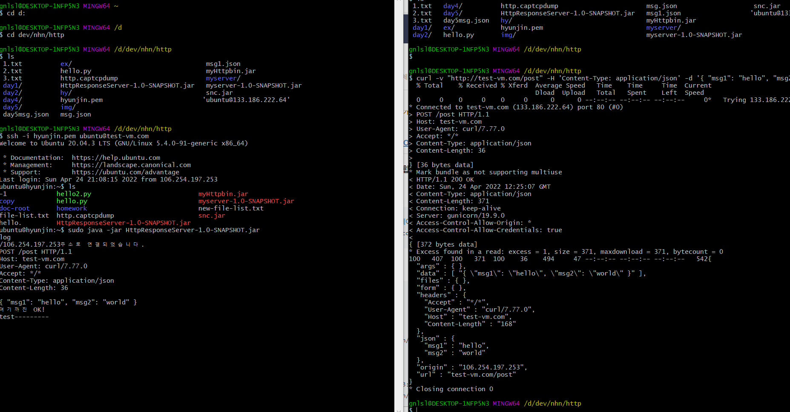
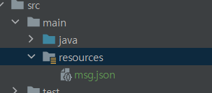

## [httpbin.org](http://httpbin.org/) 만들기

* [httpbin.org](http://httpbin.org/)라는 사이트가 있습니다.
* HTTP 관련 프로토콜을 테스트 하기 좋은 기능들을 제공하고 있는 사이트 입니다.
* [httpbin.org](http://httpbin.org/)와 같은 기능을 하는 웹서버를 만듭니다.
    * 응답은 [httpbin.org](http://httpbin.org/)와 동일하게 구성합니다. json 형식 응답.
    * 각자 자신의 [test-vm.com](http://test-vm.com/)에서 80 포트를 사용하여 동작 가능하도록 합니다.
    * simple-curl 과제에서 사용한 [httpbin.org](http://httpbin.org/)의 기능을 구현합니다.

## 기능 1 - [test-vm.com/ip](http://test-vm.com/ip)\- 클라이언트의 IP 를 출력합니다\.

### 호출 예)

실행
<br>
``` bash
$ curl -v http://test-vm.com/ip
```

응답
<br>
```
> GET /ip HTTP/1.1
> Host: test-vm.com
> User-Agent: curl/7.64.1
> Accept: */*
>
< HTTP/1.1 200 OK
< Date: Thu, 21 Apr 2022 02:56:58 GMT
< Content-Type: application/json
< Content-Length: 33
< Connection: keep-alive
< Server: gunicorn/19.9.0
< Access-Control-Allow-Origin: *
< Access-Control-Allow-Credentials: true
<
{
  "origin": "103.243.200.16"
}
```

* 응답 본문 뿐 아니라, 응답 헤더 구성을 잘 하셔야 합니다.

## 기능 2 - [test-vm.com/get](http://test-vm.com/get)요청 받은 get 메소드의 요청 형식을 응답합니다.

### 호출 예1) 인자 없이 get 요청을 합니다.

실행
<br>
``` bash
# get 에 인자 없이 호출한 경우
$ curl -v http://test-vm.com/get
```

응답
<br>
```
{
  "args": {},
  "headers": {
    "Accept": "*/*",
    "Host": "test-vm.com",
    "User-Agent": "curl/7.64.1"
  },
  "origin": "103.243.200.16",
  "url": "http://test-vm.com/get"
}
```

* `args`: 요청에서 인자 없이 호출 하였기에 `args` 부분이 비어 있습니다.
* `headers` : 클라이언트가 보낸 헤더 전체를 json 포맷에 맞추어 응답하면 됩니다.
* `orgin`: 요청 클라이언트의 IP 를 출력합니다.
* `url`: 요청 받은 url 을 출력합니다.

### 호출 예2) 인자를 1개 넣어 get 요청을 합니다.

실행
<br>
``` bash
# 요청에 인자를 1개 넘긴 경우
$ curl -X GET http://test-vm.com/get?msg1=hello
```

응답
<br>
```
{
  "args": {
    "msg1": "hello"
  },
  "headers": {
    "Accept": "*/*",
    "Host": "test-vm.com",
    "User-Agent": "curl/7.64.1"
  },
  "origin": "103.243.200.16",
  "url": "http://test-vm.com/get?msg1=hello"
}
```

* `args` 에 url 에서 넘겨준 인자 1개를 보여 줍니다.

### 호출 예3) 인자를 2개 넣어 get 요청을 합니다.

실행
<br>
``` bash
# get 요청에 인자를 2개 넣어 호출한 경우
$ curl -X GET "http://test-vm.com/get?msg1=hello&msg2=world"
```

응답
<br>
```
{
  "args": {
    "msg1": "hello",
    "msg2": "world"
  },
  "headers": {
    "Accept": "*/*",
    "Host": "test-vm.com",
    "User-Agent": "curl/7.64.1"
  },
  "origin": "103.243.200.16",
  "url": "http://test-vm.com/get?msg1=hello&msg2=world"
}
```

* `args` 에 url 에서 넘겨준 인자 2개를 보여 줍니다.

## 기능 3 - [test-vm.com/post](http://test-vm.com/post)요청 받은 post 메소드의 요청 형식을 응답합니다.

### 호출 예1) - json 데이타를 전송합니다.

실행
<br>
```
# application/json 형태의 데이타를 post 로 전송
$ curl -v "http://test-vm.com/post" -H 'Content-Type: application/json' -d '{ "msg1": "hello", "msg2": "world" }'
```

응답
<br>
```
> POST /post HTTP/1.1
> Host: test-vm.com
> User-Agent: curl/7.64.1
> Accept: */*
> Content-Type: application/json
> Content-Length: 36
>
< HTTP/1.1 200 OK
< Date: Thu, 21 Apr 2022 03:02:07 GMT
< Content-Type: application/json
< Content-Length: 476
< Connection: keep-alive
< Server: gunicorn/19.9.0
< Access-Control-Allow-Origin: *
< Access-Control-Allow-Credentials: true
<
{
  "args": {},
  "data": "{ \"msg1\": \"hello\", \"msg2\": \"world\" }",
  "files": {},
  "form": {},
  "headers": {
    "Accept": "*/*",
    "Content-Length": "36",
    "Content-Type": "application/json",
    "Host": "test-vm.com",
    "User-Agent": "curl/7.64.1"
  },
  "json": {
    "msg1": "hello",
    "msg2": "world"
  },
  "origin": "103.243.200.16",
  "url": "http://test-vm.com/post"
}
```

* `data` 부분은 body 를 가공하지 않고 그대로 출력합니다. (json 으로 표시하기 위한 escaping 만 들어가 있습니다.)
* (옵션) `json` 부분은 클라이언트가 보내준 data 부분('{ "msg1": "hello", "msg2": "world" }'을 json 형태로 파싱해서 응답합니다.

### 호출 예2) `multipart/form-data` 파일 업로드를 합니다.

실행
<br>
``` bash
# msg.json 파일의 내용을 확인 
$ cat msg.json
{ "msg1": "hello", "msg2": "world" }

# msg.json 파일을 post 로 업로드
$ curl -v -F "upload=@msg.json" http://test-vm.com/post
```

응답
<br>
```
> POST /post HTTP/1.1
> Host: test-vm.com
> User-Agent: curl/7.64.1
> Accept: */*
> Content-Length: 239
> Content-Type: multipart/form-data; boundary=------------------------ed8f614c3086fe54
>
< HTTP/1.1 200 OK
< Date: Thu, 21 Apr 2022 03:24:17 GMT
< Content-Type: application/json
< Content-Length: 510
< Connection: keep-alive
< Server: gunicorn/19.9.0
< Access-Control-Allow-Origin: *
< Access-Control-Allow-Credentials: true
<
{
  "args": {},
  "data": "",
  "files": {
    "upload": "{ \"msg1\": \"hello\", \"msg2\": \"world\" }\n"
  },
  "form": {},
  "headers": {
    "Accept": "*/*",
    "Content-Length": "239",
    "Content-Type": "multipart/form-data; boundary=------------------------ed8f614c3086fe54",
    "Host": "test-vm.com",
    "User-Agent": "curl/7.64.1"
  },
  "json": null,
  "origin": "103.243.200.16",
  "url": "http://test-vm.com/post"
}
```

## 참고

* curl 등으로 실제 http 서버가 어떻게 응답을 하고 있는지 확인하면서 진행하면 좋을 것 같습니다.











